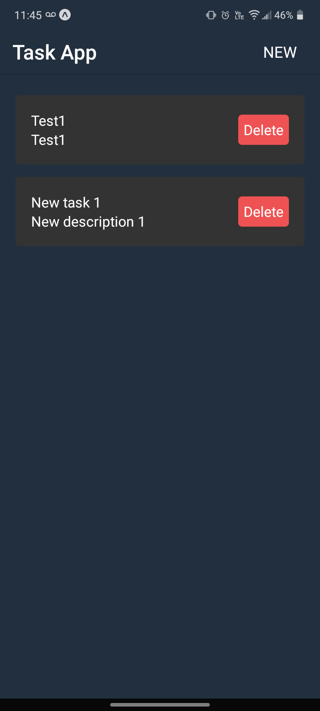
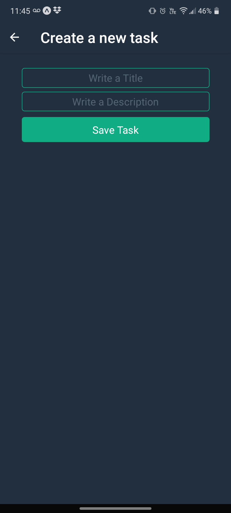
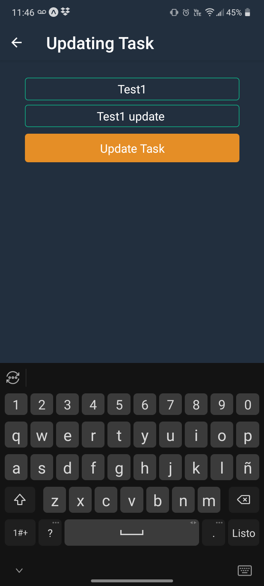

# React Native Task App

App to manage daily tasks. For Android and iOS, using Expo CLI and React Native Backend Task API [(Clone it here)](https://github.com/Saul-NH/react-native-backend-task-api.git "React Native Backend Task API")

- [Expo CLI](https://expo.io/tools#cli "Expo.io")
- [React Native](https://reactnative.dev/)

Screenshots
---------------





Getting Started
---------------

```sh
# clone it
git clone https://github.com/Saul-NH/react-native-frontend-task-app.git

# move to directory
cd react-native-frontend-task-app

# Install Expo CLI
npm install expo-cli --global

# Install dependencies
npm install

# Change with the IP of the server where the [React Native Backend Task API] is running (at line 2)
react-native-frontend-task-app/api.js
```

Run the project
---------------

```sh
# start the project
npm start

# for android
npm run android

# for ios
npm run ios

```


